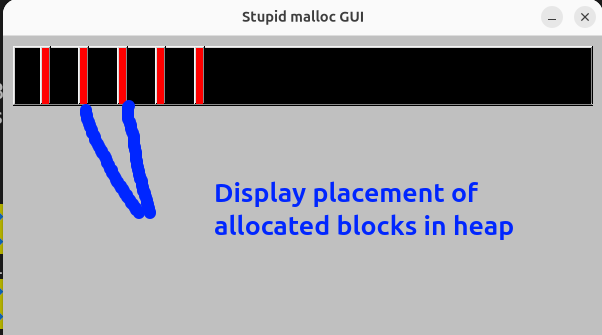

# Custom implementation of library functions for dynamic memory allocation (educational purpose only)  
  
## Library uses only plain C lang(C++ only for GUI part)
  
### System feautures:  
    - Works only on linux systems(brk and sbrk call used for extenging the heap)  
  
## Allocation core  
  Library scan all allocated parts and find enough space between them to allocate this space for new data  
  To memorize all allocations library keeps meta before the data. Meta contains size of allocation and pointer to the next allocation(to move between them and find free space)  
  If not space of needed size was found lib allocate memory in the end of data array(in the part from the end of last allocation to the end of break), if heap size is not enough for data lib extend the heap.

## GUI version
Simple wrapper for allocation functions that draw an image of heap in the window                                                                                

GUI library: FLTK